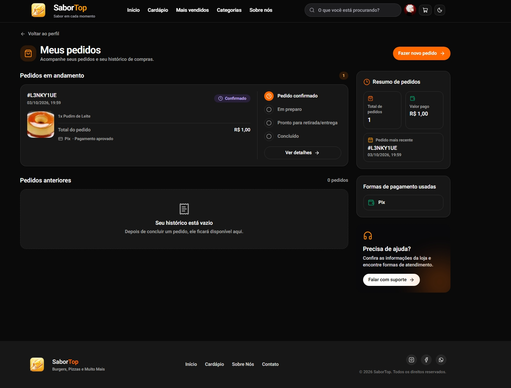

# My Market

Aplicação de pedidos online para uma loja de alimentos, construída com Next.js.
Clientes podem explorar o cardápio, gerenciar o carrinho e pagar com Pix ou
cartão. A área administrativa permite acompanhar vendas e gerenciar produtos,
categorias e pedidos.

## Telas

### Página inicial e cardápio




### Conta do cliente


## Recursos principais

- Catálogo com busca, categorias, avaliações, produtos em destaque e mais
  vendidos.
- Carrinho persistido no navegador, com suporte a um ou vários produtos.
- Preços e totais recalculados no servidor a partir do banco antes da cobrança.
- Acompanhamento de pedidos, cancelamento de pedidos pendentes, exclusão de
  pedidos cancelados não pagos e opção de comprar novamente com os preços
  atuais.
- Autenticação por email e senha, login social Google, códigos de verificação
  por email e gerenciamento de perfil.
- Painel administrativo com indicadores, vendas, pedidos recentes e produtos
  mais vendidos; gerenciamento de produtos e categorias.
- SEO por página, metadados de produtos e categorias, sitemap dinâmico e
  `robots.txt`.

## Tecnologias

- Next.js 16, React 19, TypeScript e Tailwind CSS 4.
- PostgreSQL e Prisma ORM 7 com adaptador PostgreSQL.
- Better Auth para autenticação.
- tRPC e TanStack React Query para comunicação com a API.
- Mercado Pago para pagamentos via Pix e cartão.
- Nodemailer para emails de autenticação.

## Rotas da aplicação

| Rota | Descrição |
| --- | --- |
| `/` | Página inicial |
| `/cardapio` | Catálogo de produtos |
| `/cardapio/[id]` | Detalhe do produto |
| `/categorias` | Lista de categorias |
| `/categorias/[id]` | Produtos de uma categoria |
| `/mais-vendidos` | Produtos mais vendidos |
| `/carrinho` | Carrinho e início do checkout |
| `/payment/pix` | Pagamento e acompanhamento por Pix |
| `/payment/card` | Pagamento com cartão |
| `/pedido/[id]` | Detalhes e status do pedido |
| `/perfil` | Perfil do cliente |
| `/perfil/pedidos` | Histórico e gerenciamento dos pedidos |
| `/admin` | Dashboard administrativo |
| `/admin/produtos` | Gerenciamento do catálogo |
| `/admin/categorias` | Gerenciamento das categorias |

As rotas da API incluem `/api/trpc`, `/api/payments/mercado-pago/pix`,
`/api/payments/mercado-pago/card` e `/api/webhooks/mercado-pago`.

## Requisitos

- Node.js compatível com Next.js 16.
- PostgreSQL acessível pela aplicação.
- Credenciais do Mercado Pago para habilitar pagamentos.

## Configuração local

1. Instale as dependências:

   ```bash
   npm ci
   ```

2. Crie um arquivo `.env` na raiz do projeto e configure as variáveis da seção
   [Variáveis de ambiente](#variáveis-de-ambiente). Nunca envie credenciais
   reais para o Git.

3. Gere o Prisma Client e aplique as migrações:

   ```bash
   npx prisma generate
   npx prisma migrate deploy
   ```

4. Inicie o servidor de desenvolvimento:

   ```bash
   npm run dev
   ```

   Acesse [http://localhost:3000](http://localhost:3000).

Para carregar os dados iniciais definidos em `prisma/seed.ts`, execute:

```bash
npx prisma db seed
```

## Variáveis de ambiente

| Variável | Uso |
| --- | --- |
| `DATABASE_URL` | String de conexão PostgreSQL usada pelo Prisma. |
| `BETTER_AUTH_SECRET` | Segredo usado pela autenticação. Gere um valor longo e aleatório. |
| `BETTER_AUTH_URL` | URL base pública da aplicação usada pela autenticação. |
| `APP_URL` | URL pública HTTPS da aplicação; usada para compor o webhook do Mercado Pago. Obrigatória para pagamentos em produção. |
| `NEXT_PUBLIC_SITE_URL` | URL canônica do site para metadata, sitemap e SEO. |
| `MERCADO_PAGO_ACCESS_TOKEN` | Token privado do Mercado Pago, usado no servidor. |
| `NEXT_PUBLIC_MERCADO_PAGO_PUBLIC_KEY` | Chave pública do Mercado Pago, usada pelo SDK no navegador para tokenizar cartão. |
| `MERCADO_PAGO_WEBHOOK_SECRET` | Segredo para validar a assinatura HMAC dos webhooks do Mercado Pago. |
| `GOOGLE_CLIENT_ID` | ID OAuth do Google, se o login social estiver habilitado. |
| `GOOGLE_CLIENT_SECRET` | Segredo OAuth do Google, se o login social estiver habilitado. |
| `SMTP_HOST` | Host do servidor SMTP para emails de autenticação. |
| `SMTP_PORT` | Porta SMTP; a aplicação usa TLS direto quando o valor é `465`. |
| `SMTP_USER` | Usuário SMTP. |
| `SMTP_PASSWORD` | Senha ou credencial SMTP. |
| `SMTP_FROM` | Remetente dos emails enviados. |
| `DELIVERY_FEE` | Taxa de entrega numérica; assume `0` quando não definida. |

`NEXT_PUBLIC_SITE_URL` tem precedência para SEO; na ausência dela, o projeto
considera `APP_URL`, os domínios da Vercel e, por fim,
`http://localhost:3000`. Já pagamentos do Mercado Pago precisam de `APP_URL`
(ou da URL canônica configurada) em HTTPS e publicamente acessível. O endereço
`localhost` não recebe notificações externas.

Para testar pagamentos durante o desenvolvimento, exponha a porta local por
um túnel HTTPS (por exemplo, ngrok ou Cloudflare Tunnel), defina `APP_URL` com
a URL pública fornecida e configure no painel do Mercado Pago o webhook
`/api/webhooks/mercado-pago`, incluindo o segredo de assinatura correspondente.

## Pedidos e pagamentos

O procedimento de checkout aceita um ou vários itens. O cliente pode receber
uma cotação por `order.quote`, mas o servidor sempre consulta os produtos e
calcula novamente subtotal, taxa de entrega e total antes de criar a cobrança.
Os valores monetários são tratados com `Prisma.Decimal`.

### Pix

- O pagamento é criado no Mercado Pago com validade de 30 minutos.
- Um Pix pendente e ainda válido reutiliza o mesmo QR Code em novas consultas.
- Tentativas usam uma chave de idempotência por pedido e tentativa.
- O QR Code e a validade ficam vinculados ao pedido no banco.

### Cartão

- A opção de cartão está temporariamente desativada na interface e na API.
- O checkout aceita Pix durante esse período; a rota de cartão exibe a
  indisponibilidade e oferece direcionamento para Pix.
- A integração original com o SDK Mercado Pago permanece no código, mas não
  processa novas cobranças por cartão enquanto o endpoint estiver desativado.

### Confirmação e segurança

- O webhook `/api/webhooks/mercado-pago` valida a assinatura HMAC e consulta o
  status real do pagamento diretamente no Mercado Pago.
- Antes de confirmar um pagamento aprovado, o servidor confere valor, moeda e
  correspondência com o pedido.
- A confirmação atualiza o status do pedido; pagamentos recusados, cancelados
  ou estornados mantêm status próprios no banco.
- Não marque pedidos como pagos manualmente nem confie em valores enviados pelo
  navegador.

## Banco de dados

O schema fica em `prisma/schema.prisma`; configurações do CLI Prisma 7 e seed
ficam em `prisma7.config.ts`. As migrações versionadas estão em
`prisma/migrations`.

Comandos úteis:

```bash
npx prisma generate
npx prisma migrate dev
npx prisma migrate deploy
npx prisma db seed
```

Use `migrate dev` durante o desenvolvimento para criar/aplicar migrações e
`migrate deploy` para aplicar migrações já versionadas em ambientes de
implantação.

## Desenvolvimento e validação

```bash
npm run dev
npm run lint
npm run build
npm start
```

`npm start` inicia a versão de produção após um build bem-sucedido.
